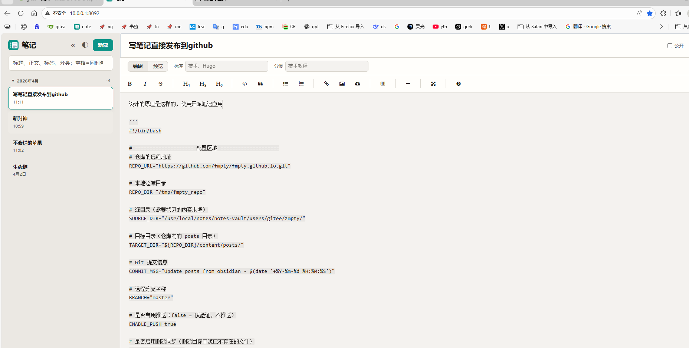

设计的原理是这样的，使用开源笔记应用直接写，然后使用如下脚本直接推送到github 通过github 的action自动生成可浏览的网页





```
#!/bin/bash

# ==================== 配置区域 ====================
# 仓库的远程地址
REPO_URL="https://github.com/fmpty/fmpty.github.io.git"

# 本地仓库目录
REPO_DIR="/tmp/fmpty_repo"

# 源目录（需要拷贝的内容来源）
SOURCE_DIR="/usr/local/notes/notes-vault/users/gitee/zmpty/"

# 目标目录（仓库内的 posts 目录）
TARGET_DIR="${REPO_DIR}/content/posts/"

# Git 提交信息
COMMIT_MSG="Update posts from obsidian - $(date '+%Y-%m-%d %H:%M:%S')"

# 远程分支名称
BRANCH="master"

# 是否启用推送（false = 仅验证，不推送）
ENABLE_PUSH=true

# 是否启用删除同步（删除目标中源已不存在的文件）
ENABLE_DELETE=false

# 是否显示详细输出
VERBOSE=true
# =================================================

# 设置错误处理
set -e

# 日志函数
log_info() {
    echo "[INFO] $(date '+%Y-%m-%d %H:%M:%S') - $1"
}

log_error() {
    echo "[ERROR] $(date '+%Y-%m-%d %H:%M:%S') - $1" >&2
}

log_success() {
    echo "[SUCCESS] $(date '+%Y-%m-%d %H:%M:%S') - $1"
}

# 显示配置信息
show_config() {
    echo "=========================================="
    echo "同步配置信息"
    echo "=========================================="
    echo "源目录: ${SOURCE_DIR}"
    echo "目标目录: ${TARGET_DIR}"
    echo "仓库目录: ${REPO_DIR}"
    echo "分支: ${BRANCH}"
    echo "推送模式: $([ "${ENABLE_PUSH}" = true ] && echo "启用" || echo "禁用（验证模式）")"
    echo "删除同步: $([ "${ENABLE_DELETE}" = true ] && echo "启用" || echo "禁用")"
    echo "=========================================="
}

# 检查依赖
check_dependencies() {
    log_info "检查依赖工具..."
    
    if ! command -v rsync &> /dev/null; then
        log_error "rsync 未安装，请安装 rsync"
        exit 1
    fi
    
    if ! command -v git &> /dev/null; then
        log_error "git 未安装，请安装 git"
        exit 1
    fi
    
    log_success "依赖检查通过"
}

# 主流程
main() {
    show_config
    
    # 1. 检查依赖
    check_dependencies
    
    # 2. 检查源目录
    if [ ! -d "${SOURCE_DIR}" ]; then
        log_error "源目录不存在: ${SOURCE_DIR}"
        exit 1
    fi
    log_success "源目录存在"
    
    # 统计源文件
    SOURCE_COUNT=$(find "${SOURCE_DIR}" -type f | wc -l)
    log_info "源目录包含 ${SOURCE_COUNT} 个文件"
    
    # 3. 处理 Git 仓库
    if [ -d "${REPO_DIR}/.git" ]; then
        log_info "本地仓库已存在，正在拉取最新变更..."
        cd "${REPO_DIR}"
        
        # 检查并切换分支
        CURRENT_BRANCH=$(git branch --show-current)
        if [ "${CURRENT_BRANCH}" != "${BRANCH}" ]; then
            log_info "从 ${CURRENT_BRANCH} 切换到 ${BRANCH} 分支"
            git checkout ${BRANCH}
        fi
        
        # 拉取最新代码（带超时）
        if timeout 30 git pull origin ${BRANCH} 2>&1; then
            log_success "拉取成功"
        else
            log_error "拉取超时或失败，继续使用本地版本"
        fi
    else
        log_info "本地仓库不存在，正在克隆..."
        rm -rf "${REPO_DIR}"
        git clone --depth 1 --branch ${BRANCH} ${REPO_URL} "${REPO_DIR}"
        cd "${REPO_DIR}"
        log_success "克隆成功"
    fi
    
    # 4. 确保目标目录存在
    mkdir -p "${TARGET_DIR}"
    log_success "目标目录已准备: ${TARGET_DIR}"
    
    # 5. 统计拷贝前文件
    BEFORE_COUNT=$(find "${TARGET_DIR}" -type f 2>/dev/null | wc -l)
    log_info "拷贝前目标目录文件数: ${BEFORE_COUNT}"
    
    # 6. 执行 rsync 同步
    log_info "开始 rsync 同步..."
    echo "   从: ${SOURCE_DIR}"
    echo "   到: ${TARGET_DIR}"
    
    # 构建 rsync 参数
    RSYNC_OPTS="-avh"
    if [ "${VERBOSE}" = true ]; then
        RSYNC_OPTS="${RSYNC_OPTS} --progress"
    fi
    
    if [ "${ENABLE_DELETE}" = true ]; then
        RSYNC_OPTS="${RSYNC_OPTS} --delete"
        log_info "启用删除同步（目标中多余的文件将被删除）"
    fi
    
    # 执行同步
    rsync ${RSYNC_OPTS} "${SOURCE_DIR}" "${TARGET_DIR}"
    
    # 7. 统计拷贝后文件
    AFTER_COUNT=$(find "${TARGET_DIR}" -type f | wc -l)
    CHANGED_COUNT=$((AFTER_COUNT - BEFORE_COUNT))
    
    log_success "同步完成"
    echo "   拷贝后目标目录文件数: ${AFTER_COUNT}"
    echo "   新增/更新文件数: ${CHANGED_COUNT}"
    
    # 8. 显示目标目录内容预览
    if [ "${VERBOSE}" = true ]; then
        echo ""
        echo "目标目录内容预览（前15个文件）:"
        ls -lh "${TARGET_DIR}" | head -15
    fi
    
    # 9. 检查 Git 状态
    cd "${REPO_DIR}"
    echo ""
    echo "=========================================="
    echo "Git 仓库状态检查"
    echo "=========================================="
    
    # 显示状态
    git status --short
    
    CHANGED_FILES=$(git status --porcelain | wc -l)
    
    if [ ${CHANGED_FILES} -gt 0 ]; then
        echo ""
        echo "=========================================="
        log_info "检测到 ${CHANGED_FILES} 个文件变更"
        echo "=========================================="
        
        # 显示变更统计
        echo ""
        echo "变更统计:"
        git diff --stat
        
        # 显示文件类型分布
        echo ""
        echo "文件类型分布:"
        git status --porcelain | awk '{print $2}' | sed 's/.*\.//' | sort | uniq -c | sort -rn | head -10
        
        if [ "${ENABLE_PUSH}" = true ]; then
            echo ""
            log_info "推送已启用，正在提交并推送..."
            git add .
            git commit -m "${COMMIT_MSG}"
            
            # 显示提交信息
            echo "提交信息: ${COMMIT_MSG}"
            
            # 推送到远程
            if timeout 30 git push origin ${BRANCH}; then
                log_success "推送成功"
            else
                log_error "推送失败或超时"
                exit 1
            fi
        else
            echo ""
            echo "=========================================="
            echo "⚠️  验证模式：检测到变更，但未提交和推送"
            echo "=========================================="
            echo ""
            echo "如需启用推送，请修改脚本中的 ENABLE_PUSH=true"
            echo ""
            echo "或者手动执行以下命令:"
            echo "  cd ${REPO_DIR}"
            echo "  git add ."
            echo "  git commit -m \"${COMMIT_MSG}\""
            echo "  git push origin ${BRANCH}"
            echo ""
            echo "查看详细变更:"
            echo "  git diff"
            echo "  git status"
        fi
    else
        log_success "没有检测到任何变更（源目录和目标目录内容一致）"
    fi
    
    # 10. 输出总结
    echo ""
    echo "=========================================="
    echo "同步流程完成！"
    echo "=========================================="
    echo "源目录: ${SOURCE_DIR}"
    echo "目标目录: ${TARGET_DIR}"
    echo "仓库目录: ${REPO_DIR}"
    echo "同步文件数: ${CHANGED_COUNT}"
    echo "Git 变更数: ${CHANGED_FILES}"
    echo "=========================================="
    
    # 11. 验证命令提示
    if [ ${CHANGED_FILES} -gt 0 ] && [ "${ENABLE_PUSH}" != true ]; then
        echo ""
        echo "验证命令:"
        echo "  # 查看拷贝的文件"
        echo "  ls -la ${TARGET_DIR}"
        echo ""
        echo "  # 对比源和目标"
        echo "  diff -r ${SOURCE_DIR} ${TARGET_DIR} | head -50"
        echo ""
        echo "  # 查看 Git 状态"
        echo "  cd ${REPO_DIR} && git status"
        echo ""
        echo "  # 查看具体变更"
        echo "  cd ${REPO_DIR} && git diff"
    fi
}

# 运行主函数
main
```
