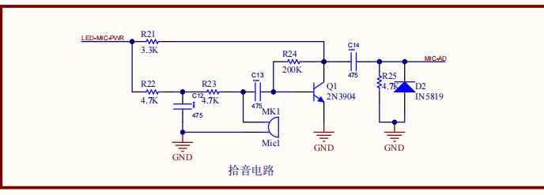
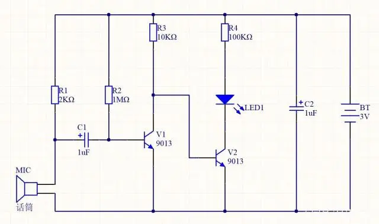
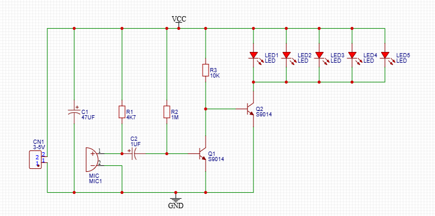
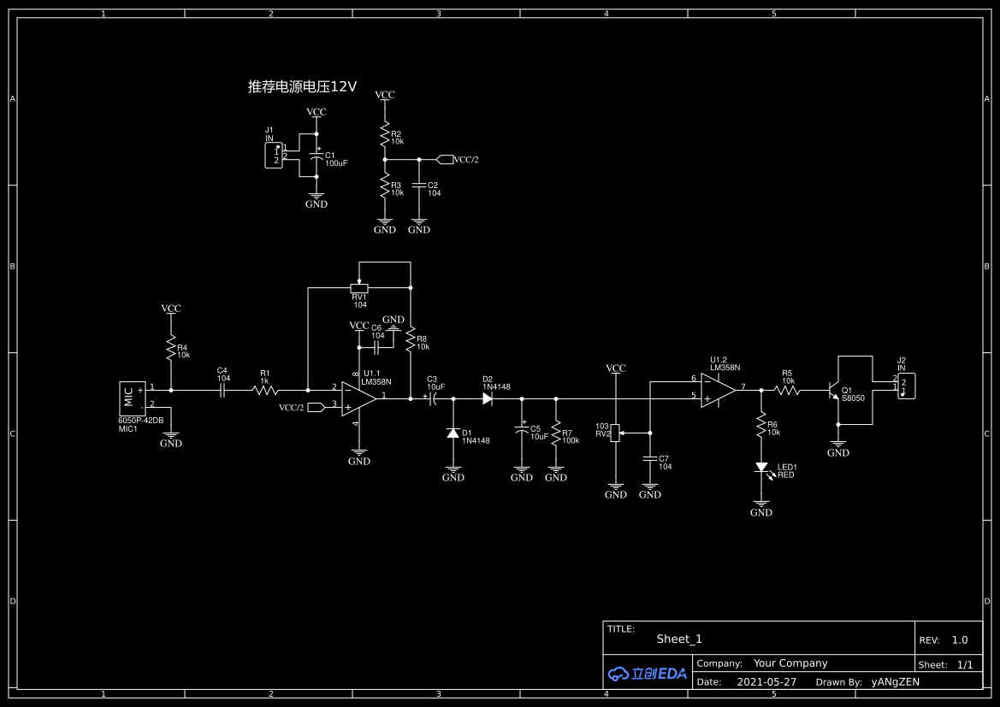

```
MCU/ADC 电源 (3.3V)
           │
          [R1 2.2kΩ 1% 贴片电阻]  <-- 唯一的偏置电阻
           │
           ├───[C1 0.1uF 贴片电容]─────────────── AIN+ (芯海 ADC 输入+)
           │
         ( 话筒 + )
         [驻极体话筒] (选最便宜的 2-pin 电机引脚或贴片式)
         ( 话筒 - )
           │
           ├───[C2 0.1uF 贴片电容]─────────────── AIN- (芯海 ADC 输入-)
           │
          GND (模拟地)
					
VCC (或 MIC_BIAS)
              │
             [R1 2.2kΩ]
              │
              ├───[C1 10uF]─────────── AIN+
              │
            ( 话筒 + )
            [驻极体话筒]
            ( 话筒 - )
              │
              ├───[C2 10uF]─────────── AIN-
              │
             [R2 2.2kΩ] (阻值必须与R1严格相等)
              │
             GND
```














```
1. 公共偏置点（先搭好这个核心电压线）用两个 $100\text{k}\Omega$ 电阻串联在电源和地之间（一个去 [VCC]，一个去 [GND]）。这两个电阻相交的那一点，就是【公共点】。直接把【运放A的 IN+ 脚】和【运放B的 IN+ 脚】全部连到这个【公共点】上。2. 话筒与运放 A（放大段）话筒负极 $\rightarrow$ [GND]话筒正极 $\rightarrow$ 接 $10\text{k}\Omega$ 电阻 $\rightarrow$ [VCC]话筒正极 $\rightarrow$ 接 $0.1\mu\text{F}$ 电容 $\rightarrow$ 运放A的 IN- 脚运放A的 IN- 脚 $\rightarrow$ 接一个 $100\text{k}\Omega$ 电阻 $\rightarrow$ 运放A的 OUT 脚3. 中间定时网络（延时段）运放A的 OUT 脚 $\rightarrow$ 接二极管（1N4148）的黑线端（负极）二极管的另一端（正极） $\rightarrow$ 连到运放B的 IN- 脚运放B的 IN- 脚 $\rightarrow$ 接一个 $330\text{k}\Omega$ 电阻 $\rightarrow$ [VCC]运放B的 IN- 脚 $\rightarrow$ 接一个 $10\mu\text{F}$ 电容正极，电容负极 $\rightarrow$ [GND]4. 运放 B 正反馈（果断输出段）运放B的 IN+ 脚 $\rightarrow$ 接一个 $1\text{M}\Omega$ 的大电阻 $\rightarrow$ 连到运放B的 OUT 脚（注意：此时运放B的 IN+ 既连着刚才的【公共点】，又通过 1MΩ 电阻连着自己的 OUT 出来）
```


