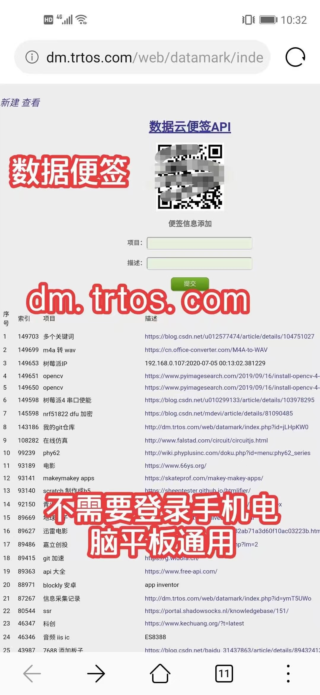
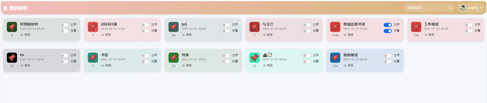

### 背景
早在2016年的时候，一次偶然的机会，同事说有个客户有这样一个需求，需要溯源产品的每个过程信息，于是就有了初版雏形，是用php 写的，早期是是搭建在共享主机里，就是那种很多人 共用一个主机 不支持自定义程序的那种，刚开始用的是香港共享主机，后来因为服务器突然删库跑路 就迁移到国内的阿里云上。后来因阿里推出了ecs主机 价格很美丽 就抢购了，用起来很好用，就本着改进得更方便的安装的目的 使用 GIN重构了第二个版本,也逐渐迷失了最初的免登录的初衷，将二维码也去掉了，使用第三方登录

### 1.0版本

### 2.0版本

