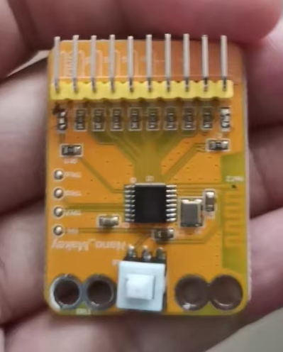

# BLE蓝牙版MakeyMakey 水果触控创意玩法教程

这是一款**蓝牙无线版 MakeyMakey**，区别于传统有线款，无需USB连线，通过插针\+鳄鱼夹搭配水果、果蔬等导电物体，替代电脑键盘/按键触发指令，可实现水果钢琴、触控游戏、创意交互等趣味玩法，零基础、全年龄段均可上手。

## 一、设备原理简介

水果、蔬菜等天然食材含有水分与电解质，具备导电特性。设备通过插针引出信号引脚，搭配鳄鱼夹连接食材，人体触碰食材后导通电路，BLE蓝牙模块将信号无线传输至设备，模拟键盘按键指令，实现无实体按键的创意触控交互。

## 二、准备材料清单

- **核心设备**：BLE蓝牙版MakeyMakey主板

- **连接配件**：杜邦插针、鳄鱼夹导线若干

- **触控介质**：香蕉、橙子、苹果、土豆、西红柿等多汁果蔬（导电效果最佳）

- **终端设备**：电脑/平板（支持蓝牙连接）

- **辅助APP**：Sratch编程软件及乐器软件和一些在线的乐器网站

## 三、设备接线说明（插针\+鳄鱼夹接法）

本次设备采用**插针转接\+鳄鱼夹固定**的专属接线方式，连接稳固、适配水果曲面，操作简单：

1. **接地接线（必接，核心关键）**

    - 取1根杜邦插针，插入主板标注 **GND/Earth** 的接地引脚

    - 插针另一端对接鳄鱼夹，使用时手持鳄鱼夹金属夹体，人体作为导电回路的接地端

2. **信号接线（功能触发）**

    - 用杜邦插针分别插入主板按键信号引脚（SPACE、UP、DOWN、LEFT、RIGHT、A、B等自定义键位）

    - 每个插针对应连接一根鳄鱼夹，将鳄鱼夹夹紧水果果肉/果皮厚实处，保证金属接触充分，避免松动断路

3. **接线注意事项**

    - 插针需完全插入主板针座，无松动、虚接

    - 鳄鱼夹必须接触水果肉质部分，仅夹表皮可能导电不良

    - 多个水果独立接线，互不干扰，可对应不同按键功能

## 四、蓝牙配对连接步骤

1. 给BLE MakeyMakey接通电源，开机后主板蓝牙指示灯闪烁，进入待配对状态

2. 打开电脑/平板蓝牙功能，搜索附近蓝牙设备

3. 找到对应设备名称（默认MakeyMakey\-BLE），点击配对连接

4. 指示灯常亮即配对成功，设备已切换为无线键盘模式，可正常触发按键指令

## 五、基础核心玩法（新手必学）

### 玩法1：水果钢琴（最经典）

适配任意在线钢琴网页、钢琴小游戏，零门槛演奏音乐。

1. 将5\-7个水果分别接线，对应主板不同按键（A、B、方向键、空格）

2. 手持接地鳄鱼夹，保持手部干燥贴合金属夹体

3. 打开电脑在线键盘钢琴网页

4. 手指依次触碰不同水果，即可触发对应音符，弹奏乐曲

### 玩法2：水果触控小游戏

适配网页小游戏、休闲闯关游戏，替代键盘操控。

- **方向操控**：水果对应上下左右方向键，操控游戏人物移动、跳跃

- **确认操作**：单个水果绑定空格键，实现游戏确认、跳跃、暂停功能

- 适合闯关、跑酷、节奏类小游戏，沉浸式交互体验

### 玩法3：创意触控触发器

可用于PPT翻页、视频暂停/播放、桌面刷新等电脑快捷操作，适配日常办公、课堂展示。

## 六、进阶拓展玩法

1. **多物体联动**：不局限于水果，可连接橡皮泥、铝箔纸、绿植、人体牵手组队，实现多人触控互动

2. **自定义键位**：通过电脑按键映射工具，修改设备触发指令，适配剪辑快捷键、编程触发、创意装置联动

3. **情景创意装置**：搭配灯光、音效软件，制作水果感应灯光、触摸触发音效的创意创客作品

## 七、常见问题排查（必看）

### 1\. 触碰水果无反应

- 检查蓝牙是否配对成功，指示灯是否常亮

- 确认接地夹是否牢牢握在手中，手部不要悬空、干燥过度（轻微湿润导电效果更好）

- 检查插针是否插紧、鳄鱼夹是否接触水果果肉，无松动、氧化

- 更换多汁水果，干瘪、脱水食材导电效果极差

### 2\. 触发不灵敏、偶尔断连

- 缩短设备与终端的蓝牙距离，远离路由器、蓝牙音箱等干扰设备

- 重新插拔插针、夹紧鳄鱼夹，加固接线点位

### 3\. 设备无法配对

- 重启设备蓝牙与电脑蓝牙，清空历史配对记录后重新连接

- 检查设备供电是否稳定，电量不足会导致蓝牙工作异常

## 八、安全与使用小贴士

- 设备为弱电安全电压，人体触碰无触电风险，儿童可放心使用，建议家长陪同操作

- 使用后及时取下鳄鱼夹，清理水果残留汁水，避免主板受潮短路

- 禁止连接高压电源、金属插座等危险物品，仅用于低压创意交互

- 长期不用时断电收纳，妥善保存插针、鳄鱼夹配件

## 九、玩法总结

BLE蓝牙版MakeyMakey摆脱了有线束缚，通过**插针\+鳄鱼夹**的灵活接线方式，让普通水果变身智能触控按键。玩法兼具趣味性与创客教育意义，既能体验音乐、游戏的互动乐趣，也能直观理解导体、电路导通、蓝牙传输的基础科学原理，适合创客实践、亲子互动、课堂教学、创意展示等多种场景。
