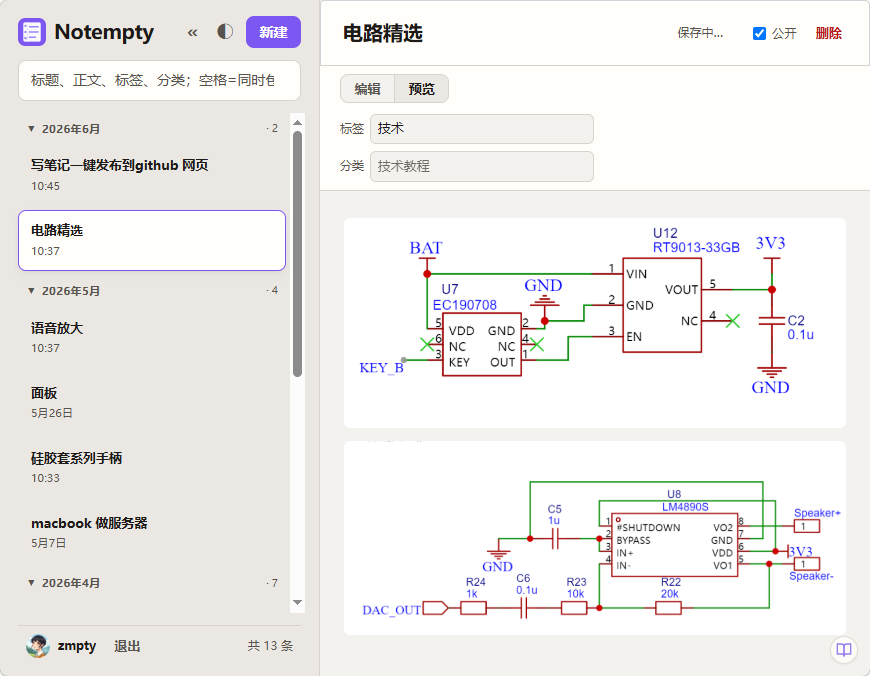

## 📝 关于悟空笔记

[悟空笔记](https://fmpty.github.io/Notempty/) 是一款支持 Markdown 并自动保存图片到本地工作目录的笔记工具，非常适合配合静态博客工作流。

## 🚀 完整工作流程

### 1️⃣ 编写笔记

在悟空笔记中正常编写 Markdown 内容，插入的图片会自动保存到**工作目录**，并在笔记中使用相对路径引用（如 ``）。



### 2️⃣ 迁移到 Hugo 仓库

将悟空笔记**工作目录**中的以下内容：
- 笔记 `.md` 文件
- 关联的图片资源（通常位于 `images/` 或同目录）

直接复制到你 Hugo 站点的 `content/posts/` 目录下。

> ⚠️ 注意保持图片相对路径不变，例如：
> ```
> content/posts/my-post.md
> content/posts/image-xxx.png
> ```

### 3️⃣ 提交并自动发布

将以上变更提交到你配置了 **GitHub Actions** 的 Hugo 仓库：

```bash
git add .
git commit -m "add new post from wukong note"
git push origin main
