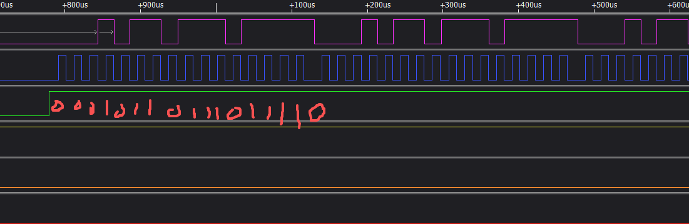

 

https://oshwhub.com/article/about-jieli-ac690n-usbkey

目标单片机型号: STC15F104W(这次使用的是104W ， 为了兼容104E不使用定时器TIME1)

1，掉电模式 ， 绿灯灭，红灯灭	(Power_En = 0                  )
2，上电直连 ， 绿灯亮，红灯闪	(Power_En = 1 & IS_ISD_MODE = 0)
3，ISD模式 ， 绿灯亮，红灯亮	(Power_En = 1 & IS_ISD_MODE = 1)

; STC15F104W @ 12M Hz 激活杰理AC69xx芯片烧录程序
; 参照《杰理科技强制升级工具用户手册.pdf》P9
; 参照 https://github.com/kagaimiq/jl-uboot-tool/blob/main/docs/how-to-enter-uboot.md
; Here, the D- is the clock line and D+ is the data line.  ----这里应该是写反了。----
; The data is sampled by the chip at the clock's rising edge.
; This key is sent continuously until the chip acknowledges it by pulling both D+ and D- to ground for at least 1-2ms. 
;
; 参照 https://github.com/kagaimiq/jielie/isp/usb/usb-key.md
; The key is a 16-bit number 0x16EF (0001 0110 1110 1111) 
; that is send MSB-first over the USB lines 
; with the D+ being the clock signal , and D- being the data signal  这里应该是正确的。
; (data is latched by the chip on its rising edge).
; The clock frequency is usually around 50 kHz
; Since the chip acknowledges the reception of the key by pulling down both USB signals

; 芯片进入强制升级模式的原理
; 1、 首要条件， 是让AC69xx芯片复位， 即AC69xx芯片要从头跑启动代码开始。
; 2、 其次， 于芯片复位之际， 工具给芯片发送握手信号， 即 usbkey， ispkey， uartkey 等等。
; 3、 最后， 芯片握手成功后， 就进入了强制升级模式， 此时 PC 端会弹出磁盘设备。
; 过程:	释放Reset按键，STC单片机启动，灯亮起；

;		USB_DM  (P3.2)设定为推挽输出，握手信号usbkey数据输出 DM（Data Minus D-） 通常用白色线
;		USB_DP  (P3.3)设定为推挽输出，握手信号usbkey时钟输出 DP（Data Positive D+）通常用绿色线
;		USB_GATE(P3.5)设定为推挽输出，高电平关断PMOS，断开DM,DP与PC的链接；
;		延时大于250mS , 参Page9 "按键是停电250ms以上，芯片复位，发握手信号。"
;		用11us的波特率移位0X016,0X0EF(usbkey)；高位在前(左移位)
;		USB_DP  (P3.3)设定为低电平输入模式，然后检测DP脚是否被MCU(AC690x)拉高，
;		未检测到高电平，从机未进入强制升级模式，回到开始；
;		
;		检测到高电平，USB_DM，USB_DP设定为输入模式，释放DP DM ；
;		再拉高USB_GATE，接通DP，DM和电脑的连接，灯熄灭；单片机休眠。
; 烧录：一定要开启Reset管脚的复位功能。
;		内部RC振荡器调整到12MHz 。
/*****************************************************************************/
#include "STC15F104E.H"      // include CPU definition file (for example, 8052)
/*****************************************************************************/
;  2025-05-02 订单编号：Y128 《Gerber_ISD-TOOL-V2》
https://github.com/jmpty/jl-uboot-tool
